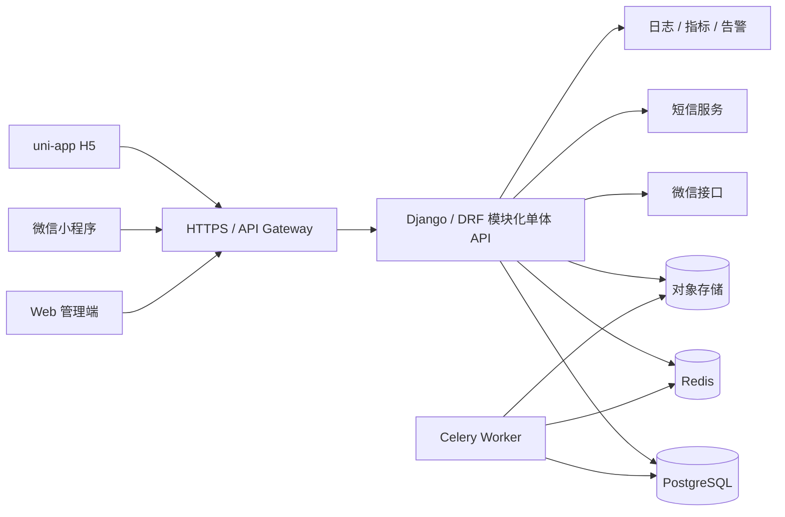

# 家常主厨后端与管理端建设计划

> 版本：v1.1
> 日期：2026-07-16
> 当前用户端：`front/`（uni-app，支持 H5 与微信小程序）
> 后端技术决策：Python + Django + Django REST Framework

## 0. 当前实施状态

截至 2026-07-17，已在不修改 `front/` 的前提下完成第一阶段工程基线：

- `server/`：Django 5.2、DRF、JWT、自定义用户模型、SQLite 本地配置、
  PostgreSQL 环境配置、OpenAPI、Django Admin、迁移、测试和 Ruff 检查。
- `admin/`：Vue 3、Vite、Element Plus 管理台，包含登录、工作台、用户、
  菜品、分类标签、教程状态、评论审核和举报处理页面。
- 已完成账号密码登录、令牌刷新、后台权限校验，以及上述管理模块的基础 API。
- 本地开发服务分别使用 `8000` 和 `5174` 端口，并已完成桌面与移动视口验证。

以下仍属于后续实施项，不应视为已上线能力：

- 微信小程序登录、微信手机号授权和短信验证码登录的第三方接口接入。
- 703 道静态菜谱的数据库导入命令、差异报告和增量同步。
- Redis、Celery、对象存储、审计日志、细粒度 RBAC 和生产部署配置。
- 教程正文的完整可视化编辑、版本差异与审核意见工作流。

## 1. 项目现状

当前菜谱由 `front/scripts/import-recipes.mjs` 生成到
`front/src/utils/cookbook.js`，用户端直接读取静态数据。

- 菜谱总数：703 道。
- HowToCook：367 道。
- CookLikeHOC：336 道。
- 业务分类：20 个，不含“全部”筛选项。
- 现有字段：ID、菜名、分类、做法、图片、耗时、难度、份量、来源、摘要、标签、材料、步骤和技巧。
- 当前尚无用户体系、在线内容管理和互动数据。

本次目标是在不破坏现有用户端的前提下，增加独立 API 服务和 Web
管理端，并将 703 道静态菜谱迁入数据库。

## 2. 建设范围

### 2.1 一期目标

1. 建立统一用户体系，一个用户可以绑定账号、手机号和微信身份。
2. 支持账号密码、微信小程序、微信手机号授权、短信验证码登录。
3. 支持用户查询、禁用、解禁、角色分配和登录记录查看。
4. 支持菜品、分类、标签和教程文章的创建、编辑、审核、发布及下架。
5. 支持评论、回复、点赞、点踩、举报和后台审核。
6. 将 703 道静态菜谱可重复、可校验地迁移到数据库。
7. 为管理操作保留审计日志。

### 2.2 一期暂不包含

- 商城、订单、支付和会员订阅。
- 用户投稿、创作者结算和复杂推荐算法。
- 微服务拆分和多地域部署。
- 原生 App 的运营商本机号码认证；未来增加 App 时单独评估。

## 3. 目录规划

```text
family-chef/
├── front/                 # 现有 uni-app 用户端：H5、微信小程序
├── server/                # 后端 API、后台任务、数据库迁移
├── admin/                 # Web 管理端
├── docs/                  # 架构、接口、部署和计划文档
├── deploy/                # Docker、反向代理、环境模板（实施时增加）
├── HowToCook/             # 上游参考数据，仅作为导入源
└── CookLikeHOC/           # 上游参考数据，仅作为导入源
```

三个业务应用分别管理依赖和环境变量。管理端不放进 `front/`，前端也不直连数据库。

## 4. 总体技术方案

### 4.1 推荐技术栈

| 层级 | 建议 | 用途 |
| --- | --- | --- |
| 用户端 | 现有 uni-app + Vue 3 | H5、微信小程序 |
| 管理端 | Vue 3 + TypeScript + Vite + Element Plus | 用户、内容和互动管理 |
| 后端 | Python + Django + Django REST Framework | REST API、认证、权限和业务逻辑 |
| ORM | Django ORM + Django Migrations | 数据建模、迁移、事务和约束 |
| 数据库 | PostgreSQL | 核心业务数据、版本和审计日志 |
| 缓存 | Redis | 验证码、限流、热点缓存和短期状态 |
| 异步任务 | Celery + Redis | 图片处理、通知、计数校准和批量任务 |
| 对象存储 | S3 兼容服务或云对象存储 | 封面、步骤图片、用户头像 |
| 接口文档 | DRF + drf-spectacular（OpenAPI） | 联调、文档和客户端类型生成 |
| 内置后台 | Django Admin | 开发初期运营、数据核查和应急管理入口 |
| 部署 | Docker Compose（开发）+ 云托管组件（生产） | 环境隔离和部署 |

一期采用“Django 模块化单体”：各业务域使用独立 Django app，在同一个 `server` 服务中运行并保持清晰边界。访问量或团队边界明确后，再拆认证、内容或互动服务。

Django Admin 用于开发初期运营、数据核查和应急处置，不能替代最终的独立 Vue 管理端。后者负责内容编辑、版本差异、审核队列等产品化工作流。

### 4.2 架构图



### 4.3 服务端模块

```text
server/
├── config/                  # settings、根路由、ASGI/WSGI、Celery 配置
├── apps/
│   ├── accounts/            # 自有用户模型、资料、手机号、微信身份
│   ├── authentication/      # 注册、登录、令牌、验证码、会话
│   ├── rbac/                # 角色、权限和 DRF 权限类
│   ├── dishes/              # 菜品、分类、标签和上下架
│   ├── recipes/             # 教程、材料、步骤、版本、审核发布
│   ├── interactions/        # 评论、赞踩和举报
│   ├── assets/              # 图片上传和资源元数据
│   ├── audit/               # 管理操作审计
│   └── common/              # 通用模型、异常、分页、健康检查
├── data/                    # 标准菜谱 JSON 和导入报告，不存敏感信息
├── tests/                   # pytest 测试
├── manage.py
├── pyproject.toml
└── Dockerfile
```

从首次迁移开始就配置 `AUTH_USER_MODEL` 并使用自定义用户模型，不能先上线 Django 默认用户表再切换。第一期 RBAC 复用 Django Groups/Permissions 并封装业务权限；用户身份、会话和审计仍使用独立业务表。

## 5. 核心业务设计

### 5.1 用户管理

用户状态：

- `active`：正常。
- `disabled`：管理员禁用，不允许登录和互动。
- `locked`：安全策略临时锁定。
- `pending_delete`：注销冷静期。
- `deleted`：逻辑删除，并完成必要的个人信息匿名化。

后台功能：

- 按用户 ID、昵称、账号、脱敏手机号、状态和注册时间查询。
- 查看绑定身份、最近登录、评论和互动概况。
- 禁用、解禁和强制所有会话下线。
- 分配后台角色；普通用户不能自动获得后台权限。
- 数据导出采用独立权限，并记录条件、时间和操作者。

### 5.2 统一身份模型

`users` 代表本地用户，账号、手机号和微信属于登录身份。一个用户可以绑定多种身份：

```text
本地用户 A
├── 用户名/密码
├── 已验证手机号
└── 微信小程序 openid（可选 unionid）
```

手机号或微信身份已经属于另一个用户时，不允许直接覆盖。必须分别验证两个账号的控制权，再执行账号合并，并保留审计记录。

### 5.3 登录与注册

#### 账号密码

1. 用户提交账号、密码和必要的验证码。
2. 服务端校验账号唯一性和密码强度。
3. 密码只保存 Argon2id 等强哈希结果，不保存明文或可逆密码。
4. 登录成功后签发短期访问令牌和可轮换的刷新令牌。
5. 连续失败触发账号、IP 和设备组合限流，必要时临时锁定。

#### 微信小程序登录

1. 小程序调用 `wx.login()` 获取临时 `code`。
2. `front` 将 `code` 发送给后端。
3. 后端使用 `appid`、`secret` 和 `code` 请求微信登录接口。
4. 后端按 `appid + openid` 查找身份，创建或读取本地用户。
5. 后端签发本系统令牌；客户端提交的裸 `openid` 不能作为登录凭证。

如能获得 `unionid`，可辅助同主体多应用的账号合并，但唯一约束仍需包含提供方和应用范围。

#### 微信手机号一键授权

1. 用户主动点击小程序手机号授权按钮。
2. 小程序同时取得 `wx.login()` 临时 `code` 和一次性手机号授权 `code`。
3. 小程序将两个 code 提交到后端的一键登录接口。
4. 后端分别向微信换取 `openid` 和已验证手机号，再按手机号查找本地用户。
5. 手机号不存在时创建用户，并绑定手机号和微信身份；手机号已存在且微信身份未冲突时，直接登录原用户并完成绑定。
6. 微信身份已经属于另一个用户时不静默覆盖，要求分别验证账号控制权后进入账号合并流程。

已登录用户也可以只调用手机号绑定接口，为当前账号补充已验证手机号。

微信手机号授权是小程序能力，不等于 H5 通用“一键登录”。H5 一期提供短信验证码登录；运营商本机号码认证需按终端、供应商和费用单独立项。

#### 短信验证码登录

1. `POST /auth/sms/send` 发送验证码，发送前进行行为验证和限流。
2. Redis 只保存验证码哈希、用途、有效期和错误次数。
3. 首次验证成功时创建用户，已有手机号则登录原用户。
4. 对手机号、IP、设备和短信模板分别限流，防止短信轰炸。

#### 会话策略

- Access Token 建议 10 至 20 分钟有效。
- Refresh Token 建议不超过 30 天，只保存哈希，并在刷新时轮换。
- H5 优先使用 `HttpOnly + Secure + SameSite` Cookie 保存刷新凭证。
- 小程序使用平台安全存储，并支持服务端撤销、设备下线和重放检测。
- 修改密码、禁用用户或发现异常后，撤销该用户所有会话。

### 5.4 菜品与教程文章

菜品和教程文章分开建模：

- 菜品负责稳定资料：名称、别名、分类、标签、封面、状态和来源。
- 教程文章负责可编辑内容：摘要、耗时、难度、份量、材料、步骤和技巧。
- 一道菜一期只有一篇主教程，但模型允许未来增加家庭版、低脂版等教程。
- 每次发布生成不可变版本，线上内容始终指向明确版本。

文章状态机：

```text
draft -> pending_review -> published -> unpublished
                  \-> rejected -> draft
```

关键规则：

- 编辑提交审核，审核员负责发布；超级管理员可作为配置例外。
- 已发布文章再次修改时生成新草稿，不覆盖线上版本。
- 下架不删除历史版本，恢复时明确选择发布版本。
- 分类和标签可启用或停用；已被引用的数据不能物理删除。

### 5.5 评论、点赞和点踩

- 评论绑定菜品，支持一级评论和回复。
- 评论状态：`pending`、`visible`、`hidden`、`rejected`、`deleted`。
- 审核策略可配置先发后审或先审后发；新用户或命中规则的内容可强制审核。
- 删除采用软删除，用户端展示“该评论已删除”，后台保留必要审计数据。
- 每个用户对同一道菜只有一个反应值：`1` 表示赞，`-1` 表示踩。
- 每个用户对同一评论同样只有一个反应值。
- 再次点击相同反应表示取消；切换反应必须在一个事务中完成。
- 聚合计数可保存在菜品和评论表，但明细是最终事实来源，并由任务定期校准。
- 增加举报入口和处理状态，避免审核只能依赖人工巡检。

## 6. 权限模型（RBAC）

### 6.1 预置角色

| 角色 | 主要权限 |
| --- | --- |
| `super_admin` | 全部权限、角色配置和系统配置 |
| `user_operator` | 用户查询、禁用/解禁、会话下线 |
| `content_editor` | 菜品、分类、标签和文章草稿编辑 |
| `content_reviewer` | 审核、发布和下架 |
| `comment_moderator` | 评论和举报审核 |
| `auditor` | 只读查看业务数据和审计日志 |

权限点示例：

```text
user:read        user:disable       user:export
role:read        role:manage
dish:read        dish:create        dish:update        dish:archive
recipe:edit      recipe:submit      recipe:review      recipe:publish
comment:read     comment:moderate    report:handle
asset:upload     audit:read
```

API 必须在服务端校验权限，不能只在管理端隐藏按钮。高风险操作要求填写原因并写入审计日志。

## 7. 数据库设计

主表统一使用 UUID 主键并包含 `created_at`、`updated_at`；需要逻辑删除的表增加 `deleted_at`。

### 7.1 用户与认证表

| 表 | 关键字段与约束 |
| --- | --- |
| `users` | 自定义 `AbstractUser` 模型：`id`、`username`、Django `password` 哈希字段、`nickname`、`avatar_asset_id`、`status`、`last_login_at`；用户名条件唯一 |
| `user_phones` | `user_id`、`phone_ciphertext`、`phone_hash`、`verified_at`；`phone_hash` 唯一 |
| `user_identities` | `user_id`、`provider`、`provider_app_id`、`provider_subject`、`unionid`；提供方、应用和主体联合唯一 |
| `auth_sessions` | `user_id`、`refresh_token_hash`、`device_id`、`platform`、`ip`、`expires_at`、`revoked_at` |
| `login_events` | 用户、登录方式、结果、IP、设备摘要、失败原因和时间 |
| `auth_group` / `auth_permission` | 复用 Django Group/Permission 表示角色和权限点 |
| 用户角色关系 | 复用自定义用户模型的 `groups` 关系；业务代码只通过 RBAC 服务访问，避免散落判断 |

手机号采用“密文 + 哈希”：密文用于受控读取，哈希用于唯一性和等值查询，管理端默认只展示脱敏值。

### 7.2 菜品与内容表

| 表 | 关键字段与约束 |
| --- | --- |
| `dish_categories` | `id`、`key`、`name`、`parent_id`、`sort_order`、`status`；`key` 唯一 |
| `tags` | `id`、`name`、`type`、`status`；有效名称唯一 |
| `dishes` | `id`、`legacy_id`、`name`、`slug`、`category_id`、`cover_asset_id`、`status`、来源字段、互动计数；`legacy_id` 唯一 |
| `dish_tags` | `dish_id`、`tag_id`；联合唯一 |
| `recipe_articles` | `id`、`dish_id`、`title`、`status`、`current_version_id`、`author_id`、`reviewer_id`、`published_at` |
| `recipe_versions` | `article_id`、`version_no`、`summary`、`cooking_minutes`、`difficulty`、`servings`、`tips_json`、`change_note`；文章和版本号联合唯一 |
| `recipe_ingredients` | `version_id`、`name`、`quantity`、`unit`、`note`、`raw_text`、`sort_order` |
| `recipe_steps` | `version_id`、`description`、`asset_id`、`duration_seconds`、`sort_order` |
| `assets` | 对象键、URL、MIME、大小、宽高、哈希、上传者和状态 |

导入时无法可靠拆分用量和单位的材料先写入 `raw_text`，由后台逐步结构化，避免迁移损失内容。

### 7.3 互动与审计表

| 表 | 关键字段与约束 |
| --- | --- |
| `comments` | `dish_id`、`user_id`、`parent_id`、`root_id`、`content`、`status`、赞踩计数、审核信息和软删除时间 |
| `dish_reactions` | `dish_id`、`user_id`、`value`；用户与菜品联合唯一，`value in (-1, 1)` |
| `comment_reactions` | `comment_id`、`user_id`、`value`；用户与评论联合唯一 |
| `content_reports` | 举报人、目标类型、目标 ID、原因、说明、状态、处理人和结果 |
| `audit_logs` | 操作者、动作、资源类型、资源 ID、变更摘要、IP、请求 ID 和时间；只追加不修改 |

### 7.4 关键索引

- `dishes(status, category_id, updated_at desc)`。
- 菜名搜索索引，实施时根据中文检索需求选择 PostgreSQL 扩展或独立搜索服务。
- `dish_tags(tag_id, dish_id)`。
- `recipe_articles(status, published_at)`。
- `comments(dish_id, status, created_at desc)`。
- `comments(root_id, created_at)`。
- `auth_sessions(user_id, revoked_at, expires_at)`。
- `audit_logs(resource_type, resource_id, created_at desc)`。
- 所有外键列建立索引；唯一约束由数据库保证，而不是仅在代码中判断。

## 8. API 草案

统一前缀为 `/api/v1`。响应包含 `requestId`，列表接口统一分页格式。

### 8.1 认证与个人中心

```text
POST   /auth/register
POST   /auth/login/password
POST   /auth/wechat/mini-program/login
POST   /auth/wechat/mini-program/login-with-phone
POST   /auth/wechat/mini-program/phone/bind
POST   /auth/sms/send
POST   /auth/login/sms
POST   /auth/token/refresh
POST   /auth/logout
POST   /auth/logout-all
GET    /users/me
PATCH  /users/me
GET    /users/me/identities
POST   /users/me/account-merge/prepare
POST   /users/me/account-merge/confirm
```

### 8.2 公开菜谱与互动

```text
GET    /categories
GET    /tags
GET    /dishes?keyword=&category=&tags=&page=&pageSize=
GET    /dishes/:id
GET    /dishes/:id/comments
POST   /dishes/:id/comments
POST   /dishes/:id/reaction        # value: 1 | -1 | 0
POST   /comments/:id/replies
POST   /comments/:id/reaction      # value: 1 | -1 | 0
DELETE /comments/:id
POST   /reports
```

菜谱详情接口一次返回当前 `detail.vue` 所需字段，避免连续请求；评论走独立分页接口。

### 8.3 管理端

```text
GET    /admin/users
GET    /admin/users/:id
PATCH  /admin/users/:id/status
POST   /admin/users/:id/revoke-sessions

GET    /admin/dishes
POST   /admin/dishes
GET    /admin/dishes/:id
PATCH  /admin/dishes/:id
POST   /admin/dishes/:id/archive

GET    /admin/categories
POST   /admin/categories
PATCH  /admin/categories/:id
GET    /admin/tags
POST   /admin/tags
PATCH  /admin/tags/:id

POST   /admin/dishes/:dishId/articles
POST   /admin/articles/:id/versions
POST   /admin/articles/:id/submit
POST   /admin/articles/:id/review
POST   /admin/articles/:id/publish
POST   /admin/articles/:id/unpublish
GET    /admin/articles/:id/versions

GET    /admin/comments
POST   /admin/comments/:id/moderate
GET    /admin/reports
POST   /admin/reports/:id/resolve
POST   /admin/assets/upload-policy
GET    /admin/audit-logs
```

发布、审核、赞踩切换、账号合并和批量迁移必须使用 Django
`transaction.atomic()` 保证数据库事务。创建评论等写接口增加幂等或重复请求保护。

## 9. 管理端页面

| 一级菜单 | 页面 | 核心操作 |
| --- | --- | --- |
| 工作台 | 数据概览 | 用户数、已发布菜品、待审核文章、待处理评论/举报 |
| 用户管理 | 用户列表、用户详情 | 筛选、状态、角色、绑定身份、会话下线 |
| 内容管理 | 菜品列表、菜品编辑 | 名称、分类、标签、封面、来源和上下架 |
| 内容管理 | 教程编辑器 | 摘要、材料、步骤、技巧、预览、草稿和提交审核 |
| 内容管理 | 审核队列、版本历史 | 差异对比、通过、驳回、发布和恢复为草稿 |
| 分类标签 | 分类管理、标签管理 | 排序、启停和引用检查 |
| 互动管理 | 评论列表、举报列表 | 搜索、隐藏、驳回、恢复和处理举报 |
| 系统管理 | 角色权限、审计日志 | 权限配置和操作追踪 |

教程编辑器需要支持材料和步骤排序、步骤图上传、移动端预览、未保存提醒和并发编辑版本检测。

## 10. 703 道菜迁移方案

### 10.1 导入原则

- 保留 `cookbook.js` 作为切换 API 初期的回退数据源。
- 保留现有 Node.js 解析逻辑，并让 `front/scripts/import-recipes.mjs` 额外输出一份结构稳定的标准 JSON；不在切换后端语言时重写已经验证过的 703 道菜解析规则。
- Django 在 `apps/dishes/management/commands/import_recipes.py` 中实现管理命令，负责 JSON 校验、`dry-run`、幂等入库和导入报告。
- 使用现有 `recipe.id` 写入 `dishes.legacy_id`，重复执行不得创建重复记录。
- 保存 `source_project`、`source_path`、`source_url` 和导入批次号。
- 首次迁移生成文章版本 1，状态设为 `draft` 或 `pending_review`，不默认全部发布。
- 图片先迁移实际使用的本地资源，失效占位图生成待处理清单。
- 对两个上游项目分别保留授权或许可证核验记录。没有许可证不等于可以任意再发布，正式上线前必须确认授权范围。

### 10.2 字段映射

| 现有字段 | 目标字段 |
| --- | --- |
| `id` | `dishes.legacy_id` |
| `title` | `dishes.name`、`recipe_articles.title` |
| `category/categoryLabel` | `dish_categories.key/name` |
| `method` | 方法类型标签 |
| `image` | `assets` + `dishes.cover_asset_id` |
| `time` | `recipe_versions.cooking_minutes` |
| `difficulty` | `recipe_versions.difficulty` |
| `servings` | `recipe_versions.servings` |
| `summary` | `recipe_versions.summary` |
| `tags` | `tags` + `dish_tags` |
| `ingredients[]` | `recipe_ingredients.raw_text` |
| `steps[]` | `recipe_steps.description` |
| `tips[]` | `recipe_versions.tips_json` |
| 来源字段 | `dishes.source_*` |

### 10.3 迁移流程

1. 运行现有 Node.js 脚本，生成前端静态数据和后端使用的标准 JSON，并校验二者菜谱 ID 集合一致。
2. 执行 `python manage.py import_recipes --input data/recipes.json --dry-run`，只校验不写库，输出总数、分类数、缺图、空字段、重复菜名和重复 ID。
3. 导入分类和标签，记录旧 key 到新 ID 的映射。
4. 使用 Django ORM 分批导入菜品、文章、版本、材料和步骤，每批使用 `transaction.atomic()`。
5. 上传或登记图片资源并回填封面引用。
6. 执行数据库校验和抽样对比。
7. 在预发布环境完成来源和内容质量审核。
8. 前端增加 API 数据源开关，灰度读取数据库，异常时可切回静态数据。

### 10.4 迁移验收

- 菜品总数等于 703。
- 来源计数为 HowToCook 367、CookLikeHOC 336。
- 业务分类数等于 20。
- `legacy_id` 无重复、无空值。
- 每道菜至少有一篇文章和一个版本。
- 每个版本至少有一条材料和步骤；兜底内容进入人工复核清单。
- 抽查不少于 50 道菜，对比标题、分类、标签、材料、步骤和来源链接。
- 同一批次重复执行后记录数不增长，数据结果一致。

## 11. 安全、隐私和内容治理

- 密钥、微信 `secret`、短信密钥和数据库密码只存于密钥服务或环境变量，不进入 Git。
- 手机号加密保存并使用不可逆哈希查询，后台默认脱敏。
- 日志禁止记录密码、验证码、完整手机号、微信会话密钥和令牌。
- 上传校验 MIME、扩展名、大小和图片尺寸，对象存储使用随机对象键和最小权限。
- 后台建议启用 MFA，并限制高权限账号的会话时长。
- 所有接口执行参数校验、服务端鉴权、限流和错误脱敏。
- Cookie 模式增加 CSRF 防护，跨域只允许明确配置的 H5 和管理端域名。
- 评论增加敏感词、频率限制、重复内容检测、举报和恢复机制。
- 用户注销后匿名化非必要资料，审计和安全记录只保留必要信息。
- 上线前补齐隐私政策、用户协议、第三方 SDK 清单、注销和个人信息处理流程。

## 12. 测试方案

### 12.1 后端

- 使用 pytest、pytest-django 和 APIClient 作为主要测试工具；测试数据库使用 PostgreSQL，不用 SQLite 替代生产数据库行为。
- 单元测试：权限、密码校验、状态机、赞踩切换和账号合并规则。
- 集成测试：PostgreSQL 事务及唯一约束、Redis 验证码和会话撤销。
- API 测试：登录、刷新、退出、内容发布和评论审核的成功及失败路径。
- 安全测试：越权、暴力登录、验证码重放、刷新令牌重放和上传伪装文件。
- 迁移测试：空库导入、重复导入、失败回滚和抽样校验。

### 12.2 用户端与管理端

- H5 和微信小程序分别验证登录、令牌续期、退出和身份绑定。
- 验证菜品列表、搜索、筛选、详情、评论和赞踩状态一致性。
- 验证不同后台角色的菜单、按钮和服务端权限。
- 发布后确认用户端读取指定版本，草稿不会泄露。
- 对网络超时、重复点击、上传失败和并发编辑提供可恢复状态。

## 13. 部署与运维

- `development`：本地 Docker Compose，使用测试凭证或模拟器。
- `staging`：独立数据库、Redis、对象存储和域名，配置接近生产。
- `production`：生产凭证、备份、监控、告警和最小权限网络策略。
- H5 与 `admin` 构建为静态文件，由 CDN、对象存储或 Nginx 托管。
- `server` 使用 Gunicorn 运行 Django ASGI/WSGI 应用，并提供 `/health/live` 和 `/health/ready`。
- Celery Worker 独立容器运行；定时校准、资源处理等周期任务使用 Celery Beat，不能在 Web 进程中启动重复调度器。
- PostgreSQL 每日备份并定期验证恢复，数据库迁移前先备份。
- Redis 不作为核心业务数据的唯一存储。
- 接入结构化日志、请求 ID、错误告警、接口延迟和连接池监控。
- 数据库变更遵循先扩展、再发布应用、最后清理旧字段的向前兼容策略。

## 14. 分阶段实施计划

以下为一名熟悉 Python/Django 和 Vue 的全栈开发者估算。微信、短信资质和内容审核人力可能影响实际周期。

### 阶段 0：工程基础（2 至 3 个工作日）

- 创建 Django `server/`、Vue `admin/`、开发环境和 CI。
- 建立自定义用户模型、Django Migrations、配置校验、日志、统一异常和 OpenAPI。
- 配置 PostgreSQL、Redis、Celery、pytest 和 Django Admin 基础入口。
- 输出环境变量模板，不提交真实密钥。

验收：服务、管理端和依赖组件可启动，健康检查和数据库迁移可执行。

### 阶段 1：用户与认证（5 至 8 个工作日）

- 用户、身份、手机号、会话、角色权限和登录事件表。
- 账号密码、短信验证码、微信小程序登录和手机号绑定。
- 用户管理页面、禁用、解禁和会话下线。

验收：三类登录链路可用；同一用户可绑定多种身份；禁用后所有会话失效；越权测试通过。

### 阶段 2：菜品与内容（8 至 12 个工作日）

- 分类、标签、菜品、文章版本、材料、步骤和资源上传。
- 管理端列表、编辑器、审核队列、发布/下架和版本记录。
- 用户端菜谱列表和详情 API。

验收：编辑草稿不影响线上内容；审核发布后 H5 和小程序读取一致；历史版本可追溯。

### 阶段 3：互动管理（5 至 7 个工作日）

- 评论、回复、赞踩、举报、审核和计数校准。
- 用户端互动 UI 与管理端审核页面。

验收：唯一反应约束有效；重复请求不重复计数；禁用用户不能互动；隐藏评论不可见。

### 阶段 4：迁移与上线（5 至 8 个工作日）

- Node.js 标准 JSON 导出、Django 管理命令导入、资源迁移、质量报告和来源核验。
- 前端静态/API 数据源切换、预发布回归和上线演练。
- 监控、告警、运行手册、备份和回滚演练。

验收：迁移校验全部通过；H5 和小程序核心流程通过；应用版本可在不丢数据的情况下回滚。

**一期总估算：25 至 38 个工作日。** 微信主体认证、短信签名模板、域名备案和小程序安全域名应并行申请。

## 15. 一期完成定义

1. 用户可通过账号密码、微信小程序和已验证手机号完成注册、登录或身份绑定。
2. 用户禁用后不能刷新令牌、评论或赞踩，已有会话可立即撤销。
3. 管理员可以管理用户、菜品、分类、标签、文章、评论和举报。
4. 内容具备草稿、审核、发布、下架和版本追踪，未授权人员不能发布。
5. 同一用户对同一目标最多有一条赞踩记录，聚合计数与明细一致。
6. 703 道菜完整迁入数据库，并通过数量、分类、字段和幂等校验。
7. H5 和微信小程序通过 API 获取菜谱，并在切换期保留静态数据回退开关。
8. 敏感字段脱敏、日志过滤、限流、审计、备份和恢复演练均有记录。
9. 核心接口具有自动化测试，预发布完成角色越权和主要用户流程验收。

## 16. 实施前待确认事项

- 账号注册允许纯用户名，还是必须绑定手机号。
- 评论采用先发后审还是先审后发，回复是否限制为两级。
- 点赞/点踩作用于菜品还是文章；本文一期按菜品处理。
- 内容编辑和审核是否必须由不同管理员完成。
- 菜谱图片的来源和授权记录方式。
- CookLikeHOC 内容正式再发布的授权结论。
- 短信供应商、发送地区、签名和模板资质。
- 生产云厂商、对象存储、域名和备案状态。

## 17. 实施参考

- Django 自定义用户模型：<https://docs.djangoproject.com/en/stable/topics/auth/customizing/>
- Django 认证与权限：<https://docs.djangoproject.com/en/stable/topics/auth/default/>
- Django 密码管理：<https://docs.djangoproject.com/en/stable/topics/auth/passwords/>
- Django 数据库事务：<https://docs.djangoproject.com/en/stable/topics/db/transactions/>
- Django REST Framework：<https://www.django-rest-framework.org/>
- Celery Django 集成：<https://docs.celeryq.dev/en/stable/django/first-steps-with-django.html>
- 微信小程序登录：<https://developers.weixin.qq.com/miniprogram/dev/framework/open-ability/login.html>
- 微信小程序手机号能力：<https://developers.weixin.qq.com/miniprogram/dev/framework/open-ability/getPhoneNumber.html>
- PostgreSQL：<https://www.postgresql.org/docs/current/>
- Redis：<https://redis.io/docs/latest/>
